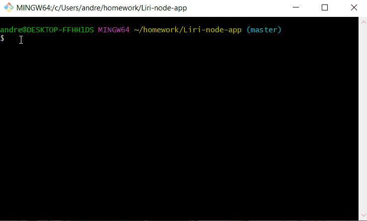
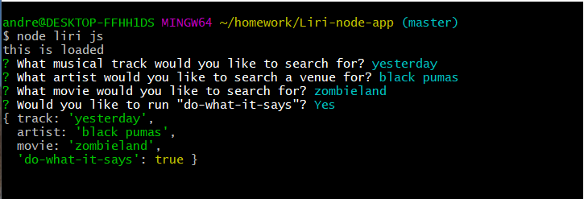
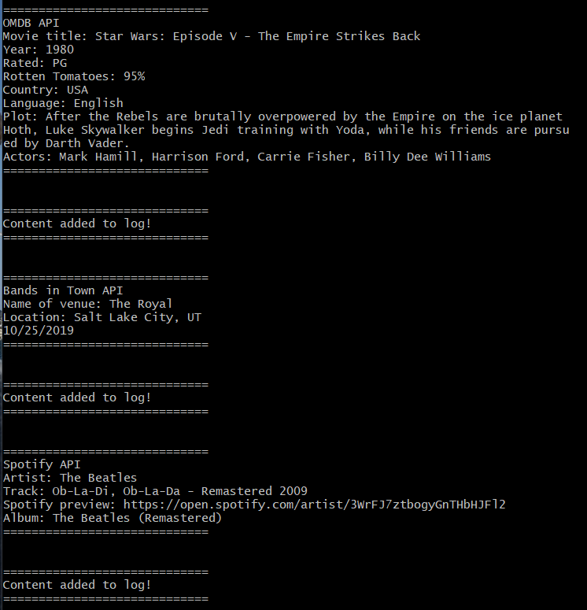

# Lire-node-app

This is a simple Command Line Interface, in Node.js, allowing us to take in user information through a series of prompts.  Based upon that user input, we are able to search 3 different API's for information pertaining to a specific music track, movie, or a performance venue for a participating band.

To accomplish this, we are using the following NPM's:

*Axios
*Dotenv
*Inquirer
*Moment
*Node-Spotify-API

Our API keys are stored locally in an .env file.  Gitignore allows us keep them private, while they maintain accessiblity through keys.js.  All search queries will append to the log.txt file.

To initiate the program, from the terminal command line, simply type "node liri js".

The Inquirer NPM will prompt the user.  Answer the 4 prompts pushing enter each time.

The user input is then logged to the console as an object:

Results as displayed in the terminal:

A video narrative is provided at the link below:

[google link](https://drive.google.com/file/d/1rI2yh2UyRl12WQhUsshprc2KLmShRIT-/view?usp=sharing)

Having been given simple directions on the project, my role in development was to build the project from the ground up.  From downloading the appropriate NPM's, to Javascript programming, to QA.  Thanks for viewing.